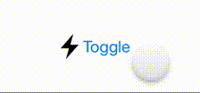

# Multiple State Toggle UIButton
A UIButton subclass that implements tap-to-toggle button text. (Like the camera flash and timer buttons)


[![Swift Version][swift-image]][swift-url]
[![Build Status][travis-image]][travis-url]
[![License][license-image]][license-url]
[](https://img.shields.io/cocoapods/v/MultiToggleButton.svg)  
[](http://cocoapods.org/pods/MultiToggleButton)
[](http://makeapullrequest.com)

<p align="center">

</p>

## Usage

Just **create** it with the states, and it's good to go:

```swift
let toggleButton = MultiToggleButton(image: myImage, states: ["First", "Second", "Last"])
```

Get and set the **current state**:

```swift
let state = toggleButton.currentStateIndex
toggleButton.currentStateIndex = 0
```

Add a **tap action** (in addition to the built-in state toggle):

```swift
toggleButton.action = { (sender) -> () in
    doStuff(sender.currentStateIndex)
}
```

Set **different colors** for different states (`nil` uses the button's ```tintColor```):

```swift
toggleButton.colors = [nil, .gray, .red]
```

Set **different images** for different states:

```swift
toggleButton.images = [myFirstImage, mySecondImage, myLastImage]
```

Or do it **all at once**:

```swift
let toggleButton = ToggleButton(
    images: [myFirstImage, mySecondImage, myLastImage],
    states: ["First", "Second", "Last"],
    colors: [nil, .gray, .red],
    action: { (sender) -> () in doStuff(sender.currentStateIndex) }
)
```

## Installation

### CocoaPods:

```ruby
pod 'MultiToggleButton'
```

Legacy versions:

| Swift version | MultiToggleButton version |
| :---: | :---: |
| 4.0 | 1.7.1 |
| 3 | 1.5.2 |
| 2.3 | 1.4.0 |

### Manually:

Copy `Sources/MultiToggleButton.swift` to your Xcode project.

## Meta

[@yonatsharon](https://twitter.com/yonatsharon)

[https://github.com/yonat/MultiToggleButton](https://github.com/yonat/MultiToggleButton)

[swift-image]:https://img.shields.io/badge/swift-4.2-orange.svg
[swift-url]: https://swift.org/
[license-image]: https://img.shields.io/badge/License-MIT-blue.svg
[license-url]: LICENSE.txt
[travis-image]: https://img.shields.io/travis/dbader/node-datadog-metrics/master.svg?style=flat-square
[travis-url]: https://travis-ci.org/dbader/node-datadog-metrics
[codebeat-image]: https://codebeat.co/badges/c19b47ea-2f9d-45df-8458-b2d952fe9dad
[codebeat-url]: https://codebeat.co/projects/github-com-vsouza-awesomeios-com
